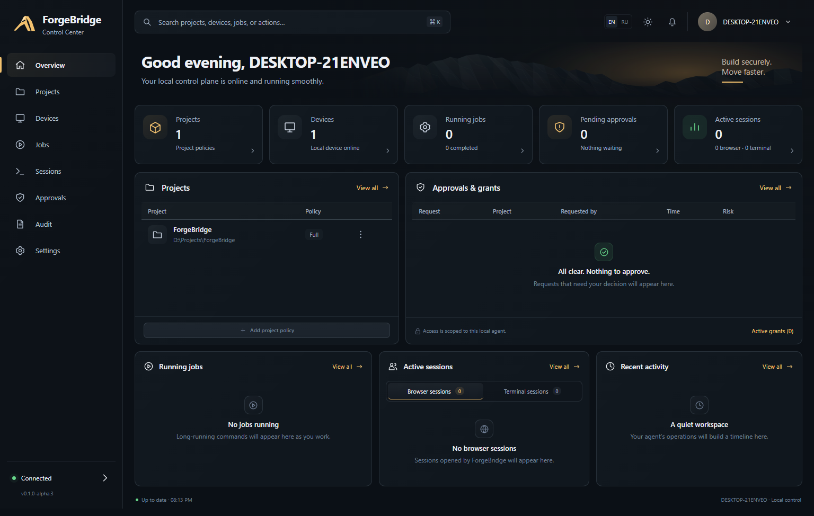
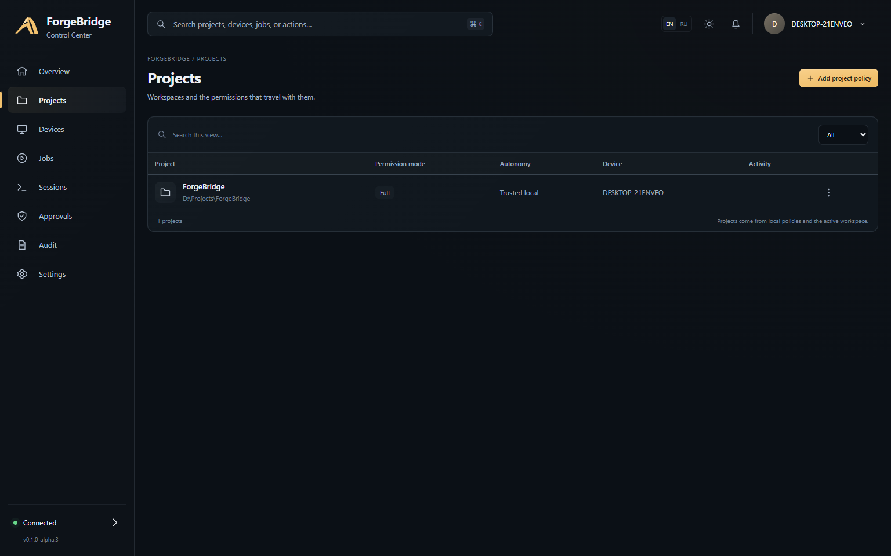
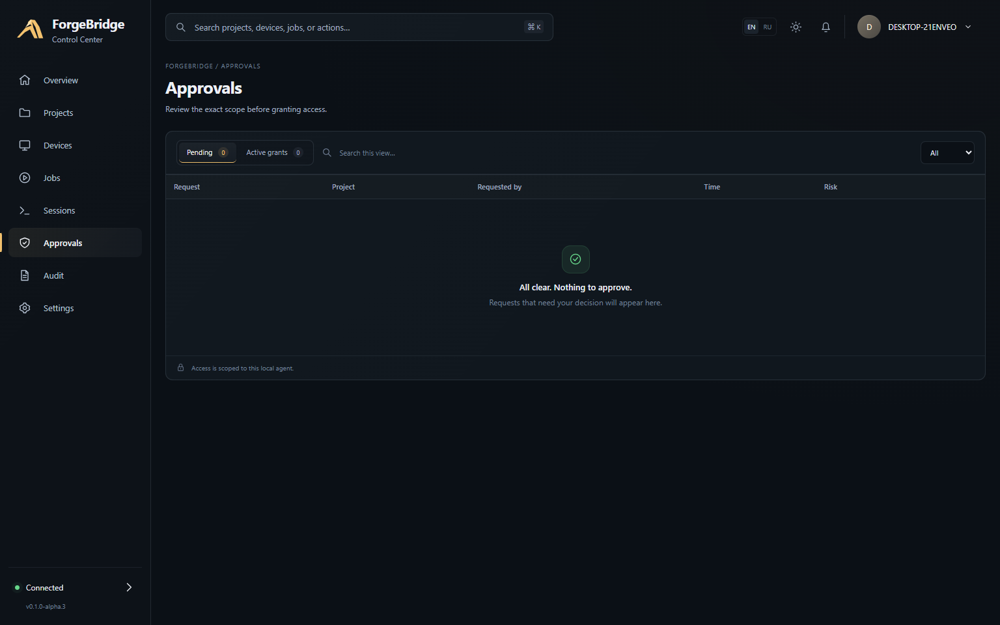
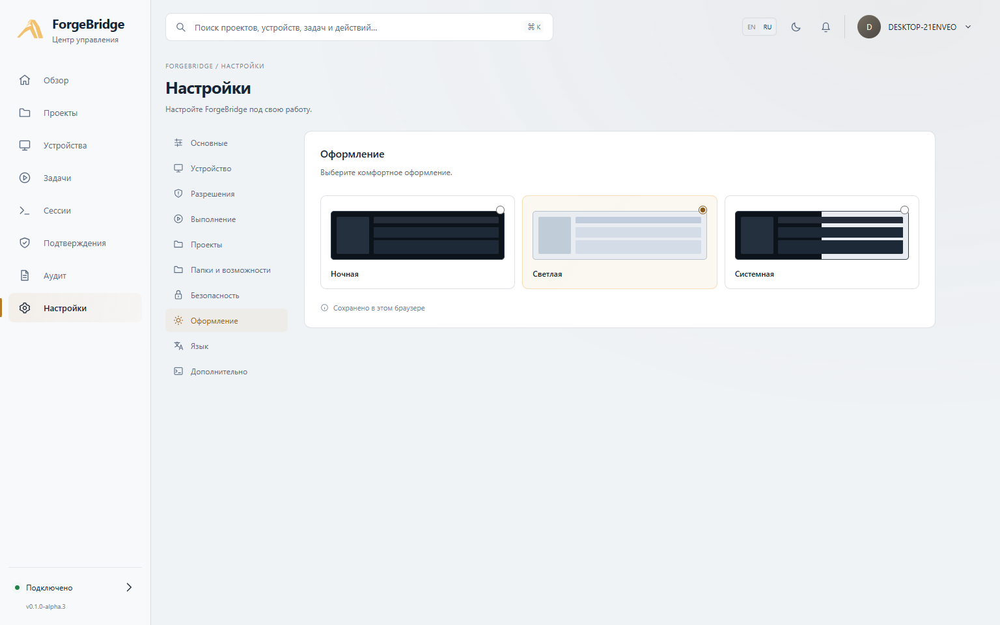

# ForgeBridge

[](https://github.com/t1ktakdev/ForgeBridge/actions/workflows/ci.yml)
[](https://www.npmjs.com/package/forgebridge)
[](https://github.com/t1ktakdev/ForgeBridge/releases)
[](LICENSE)
[](ROADMAP.md)


[Русская документация](README.ru.md)

> **Status: public alpha / beta testing.** ForgeBridge is available for early real-world testing,
> but it is not a stable production release yet. Commands, MCP schemas, configuration, and behavior
> may change between alpha/beta versions. The project will continue to receive updates, fixes, UX
> improvements, and new capabilities.

ForgeBridge is a local, permissioned MCP agent for development work on a computer the user owns and
explicitly authorizes. It is designed for filesystem editing, interactive terminals, durable jobs,
Git workflows, and semantic browser testing from compatible AI clients. For model-driven
development, ForgeBridge exposes semantic project inspection, Git reads, and reviewed validation
operations so routine work does not require arbitrary shell commands. Start with `project_inspect`
to learn the project stack, Git state, host OS, and shell in one bounded call. See
[the model-first workflow](docs/model-workflows.md).

This repository is under active development toward v0.1 and should be treated as test/beta software.
Current status and verified limitations are tracked in
[the implementation plan](docs/implementation-plan.md). Issues and feedback are welcome; future
releases will continue improving stability, onboarding, remote/multi-device UX, and tool coverage.

## Control Center

ForgeBridge includes a local Control Center for understanding what the agent is doing, reviewing
permissions, following jobs and sessions, and inspecting the audit trail without digging through raw
state files.

<p align="center">
  
</p>

| Projects                                                                            | Approvals                                                                             |
| ----------------------------------------------------------------------------------- | ------------------------------------------------------------------------------------- |
|  |  |

<p align="center">
  
</p>

The interface supports English and Russian, dark and light themes, responsive layouts, live jobs,
sessions, approvals, project policies, and a redacted audit feed backed by the real local Control
API.

## Project status

**Current public release:** `v0.1.0-alpha.4` · **Channel:** `next` · **Estimated v1.0 readiness:**
**≈68%**

> The percentage is a weighted milestone estimate, not a quality score or release date. It is
> updated as major product blocks move from experimental to release-ready.

| Area                                                                              | Status                      |
| --------------------------------------------------------------------------------- | --------------------------- |
| Local agent, permissions, audit, filesystem, Git, terminal, durable jobs, browser | ✅ Shipped                  |
| Control Center, RU/EN, themes, lifecycle actions, guided setup                    | ✅ Shipped                  |
| Cross-platform CI, npm package, MCP Registry, SBOM/checksums                      | ✅ Shipped                  |
| Update / repair / recovery                                                        | 🟡 In progress              |
| Public API stability, migrations, deprecation policy                              | 🟡 In progress              |
| Multi-device / remote routing                                                     | 🟠 Next major product block |
| Compatibility matrix + independent security pass                                  | 🟠 Required before 1.0      |

**Next milestone:** `0.2.0-beta.1` — multi-device foundation, lifecycle/update UX, and the first
compatibility freeze.

See the full [Road to 1.0](ROADMAP.md).

## Quick start

The public alpha package name is `forgebridge`; the installed command stays `forgebridge`. Once the
first npm release is live:

```sh
npm install --global forgebridge@next
forgebridge init --root /path/to/your/project
forgebridge doctor
forgebridge browser install
forgebridge serve --transport stdio
```

MCP clients that launch stdio servers can run ForgeBridge without a global install:

```sh
npx -y forgebridge@next serve --transport stdio
```

ForgeBridge is also prepared for discovery through the official MCP Registry as
`io.github.t1ktakdev/forgebridge`. Browser automation needs a reviewed Chromium/Chrome/Edge
installation; Windows UI Automation remains opt-in. See
[installation and packaging](docs/installation.md) for platform-specific setup.

## Design

ForgeBridge keeps privileged enforcement on the workstation:

- every action is checked by a deny-first permission engine;
- paths are restricted to canonical allowed roots;
- write approvals are bound to the exact action and expire;
- terminal and job output is bounded and paginated;
- browser sessions are isolated by default;
- the default BACKGROUND execution profile forces headless browsers and defers focus-changing
  desktop actions;
- attempted and completed actions are written to a redacted, hash-chained audit log.

For ChatGPT web, the preferred v0.1 transport is
[OpenAI Secure MCP Tunnel](https://developers.openai.com/api/docs/guides/secure-mcp-tunnels), which
creates an outbound HTTPS path without publishing a port on the workstation. Local MCP clients can
use stdio directly.

See:

- [Model-first development workflow](docs/model-workflows.md)
- [Research](docs/research.md)
- [Architecture](docs/architecture.md)
- [Security model](docs/security-model.md)
- [Security validation matrix](docs/security-validation.md)
- [Windows validation record](docs/validation.md)
- [2026-09-15 model-UX hardening validation](docs/hardening-validation-2026-09-15.md)
- [Release-readiness audit](docs/release-readiness.md)
- [Permission model](docs/permission-model.md)
- [Threat model](docs/threat-model.md)
- [Secure tunnel runbook](docs/secure-tunnel.md)
- [Windows autostart](docs/autostart-windows.md)
- [Background execution and focus protection](docs/background-execution.md)
- [Implementation plan](docs/implementation-plan.md)

## Development

Requirements: Node.js 22 or newer, pnpm 11, Git, and Windows 10/11 for native validation.

```powershell
pnpm install
pnpm check
pnpm build
node dist/cli.js init --root C:\src\my-project
node dist/cli.js serve --transport stdio
```

## Trusted local development

For a repository you explicitly trust, ForgeBridge can remove repeat approval prompts for reviewed
repository-defined validation while keeping the same canonical root boundary and hard-deny rules:

```powershell
forgebridge project trust C:\src\my-project
```

This creates a per-project `FULL` profile with `autonomy: trusted-local`. It is intentionally local
configuration: repository files cannot enable it. Reviewed `project_check` plans can then run
without a fresh approval, while destructive commands, Git push, elevation, persistence, secret
access, consequential browser/Windows submissions, and anything outside the configured root remain
gated or denied. Revert with `forgebridge project set PATH --mode balanced --autonomy standard` or
remove the project profile with `forgebridge project remove PATH`.

## Local installation

ForgeBridge is packaged as an npm-compatible tarball because `node-pty` is a native dependency and
Playwright browser binaries are platform-specific. Nothing is published by the release scripts.

```powershell
pnpm run package:artifact
pnpm run package:validate
.\scripts\install-windows.ps1 -PackagePath .\release\forgebridge-0.1.0-alpha.4.tgz -InstallChromium
```

The artifact includes a CycloneDX SBOM and a SHA-256 checksum. Validation installs the actual
tarball in a disposable prefix and exercises the installed CLI, MCP stdio, filesystem, terminal, and
headless browser paths. See [installation and upgrade instructions](docs/installation.md).

Optional Windows autostart is available after installation through
[`configure-autostart-windows.ps1`](docs/autostart-windows.md). It creates a current-user scheduled
task only after explicit local configuration and stores the least-privilege tunnel runtime key with
Windows DPAPI; the default installer still creates no startup entry.

Optional Windows UI Automation is disabled by default. Set `windowsUiAutomation.enabled` to `true`
in the local config to expose bounded semantic Windows element trees and control-pattern actions. It
requires an unlocked interactive desktop and never bypasses cross-user or elevation boundaries.
Focus-changing actions are durably deferred in BACKGROUND and GAMING profiles and require local
approval plus an explicit switch to NORMAL.

The agent never installs auto-start or a background service implicitly. Do not expose its local HTTP
endpoint to a network interface.

Before any public alpha, complete the remaining external gates listed in the
[release-readiness audit](docs/release-readiness.md), including a separate clean Windows VM run,
artifact signing, and an independent security review. Live Secure MCP Tunnel/ChatGPT validation has
already passed for the recorded Windows configuration.

## Security

ForgeBridge is powerful by design. An approved arbitrary shell has the authority of the OS account
running the agent. For containment, use a dedicated low-privilege account, Windows Sandbox/VM, or
another OS-enforced isolation boundary. Read [SECURITY.md](SECURITY.md) before using the agent on
sensitive systems.

## License

Apache License 2.0. See [LICENSE](LICENSE).
